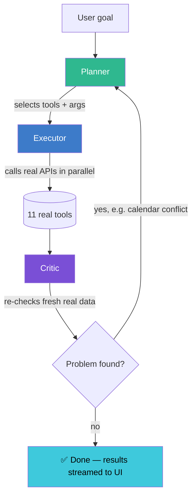

<div align="center">

# 旬 Shundo

### An autonomous AI agent that turns a vague goal into real, executed actions.

*The moment something is ready — Shundo finds it, and acts.*

[](https://shundo.pages.dev)
[](#license)

[](https://python.org)
[](https://fastapi.tiangolo.com)
[](https://langchain-ai.github.io/langgraph/)
[](https://react.dev)
[](https://vitejs.dev)
[](https://console.cloud.google.com)

**[Try the live demo →](https://shundo.pages.dev)**

</div>

---

## Table of contents

- [What it is](#what-it-is)
- [Why it's different](#why-its-different)
- [How it works](#how-it-works)
- [The 11 tools](#the-11-tools)
- [Real multi-user support](#real-multi-user-support)
- [Frontend](#frontend)
- [Tech stack](#tech-stack)
- [Running it locally](#running-it-locally)
- [Known limitations](#known-limitations)
- [Contributors](#contributors)
- [License](#license)

---

## What it is

Give Shundo a goal — *"plan a weekend trip to Goa," "schedule a study block this week," "plan the best way to learn DSA"* — and it doesn't hand back a text plan you still have to go execute yourself. It **reasons** through the goal, **decides** which real tools it needs, **calls** them for real against live services, **checks** its own work against fresh data, and **fixes** its own mistakes before it's done.

The name comes from the Japanese word **旬 (shun)** — the peak moment, when something is exactly ready. That's the whole idea: Shundo finds the right moment and the right action for any goal, and actually does it.

---

## Why it's different

Most "AI agent" demos are a single LLM call wrapped in a chat box. Shundo isn't:

| | Typical agent wrapper | Shundo |
|---|---|---|
| Reasoning | One LLM call, done | Planner → Executor → **Critic** — a real second pass that checks real data |
| Actions | Simulated / described | Real Google Calendar writes, real Gmail drafts, real live prices |
| Self-correction | None | Critic re-fetches real state and can force a full replan |
| Domain | Hardcoded per use case | Fully domain-agnostic — same loop, any goal |
| Visibility | Spinner → final answer | Every step streamed live over WebSocket as it happens |
| Users | Single shared session | Real per-user isolation — your data, your calendar, your login |

---

## How it works

Shundo runs on a three-agent graph built with **LangGraph**:



- **Planner** reads the goal and the full tool registry — via Python's `inspect`, it sees each tool's *real* function signature, not a vague description — and decides what to call and with what arguments. Nothing is hardcoded per domain.
- **Executor** calls the selected tools for real, in parallel where possible, against real APIs.
- **Critic** re-fetches **fresh, real data** after the fact — not the Planner's assumptions — and checks it. If something's wrong, it routes back to the Planner with the specific problem, and the loop runs again.

This loop is provably real, not simulated: in testing, the Critic caught an actual double-booked calendar slot, described the conflict back to the Planner, and the Planner proposed a different time — verified against a real Google Calendar.

The entire trace streams live to the frontend over a **WebSocket**, so you watch the agent think step-by-step instead of staring at a spinner.

---

## The 11 tools

<table>
<tr><th>Tool</th><th>What it does</th><th>Real data source</th></tr>
<tr><td>📅 <b>Calendar</b></td><td>Reads &amp; writes real events, per logged-in user</td><td>Google Calendar API</td></tr>
<tr><td>✉️ <b>Email drafts</b></td><td>Creates real Gmail drafts (never auto-sends)</td><td>Gmail API</td></tr>
<tr><td>✈️ <b>Flights</b></td><td>Live flight price search</td><td>Serper.dev + LLM extraction</td></tr>
<tr><td>🏨 <b>Hotels</b></td><td>Live hotel price search</td><td>Serper.dev + LLM extraction</td></tr>
<tr><td>🎟️ <b>Events</b></td><td>Local event search</td><td>Serper.dev + LLM extraction</td></tr>
<tr><td>📍 <b>Places</b></td><td>Restaurants, cafes, attractions nearby</td><td>OpenStreetMap</td></tr>
<tr><td>🔎 <b>Web search</b></td><td>General research</td><td>Serper.dev</td></tr>
<tr><td>🌦️ <b>Weather</b></td><td>Real forecast, any city</td><td>Open-Meteo</td></tr>
<tr><td>💱 <b>Currency</b></td><td>Live exchange-rate conversion</td><td>open.er-api.com</td></tr>
<tr><td>✅ <b>Tasks</b></td><td>Create / list / complete reminders</td><td>SQLite, isolated per user</td></tr>
<tr><td>💰 <b>Budget</b></td><td>Log and total real expenses</td><td>SQLite, isolated per user</td></tr>
</table>

Every service above is genuinely free — **no paid API keys anywhere in this stack.**

---

## Real multi-user support

This isn't a single shared demo session — each visitor gets real isolation:

- 🔒 **Guests** — Tasks/Budget/Notes are private to their own browser session; no visitor sees another's data
- 🔑 **Logged-in users** — each person's real Google login is stored separately. When a friend signs in with their own Gmail, **their own** real calendar and email get used — fully isolated from your account and everyone else's
- ⏱️ **Rate limiting** — capped runs per session per hour, so the shared free-tier LLM quota stays usable for everyone

---

## Frontend

A full multi-page React app, not a single demo screen:

- 🏠 **Landing** — animated hero, interactive paint-trail cursor, glassmorphic design, scroll-triggered reveals
- 🔐 **Login** — real Google OAuth, or guest mode
- 📊 **Dashboard** — type a goal, watch the agent think **live**, see results as readable cards instead of raw JSON
- 📅 **Calendar** — real upcoming events, pulled live
- ✅ **Tasks** — real add/complete list
- 💰 **Budget tracker** — real expense log + running total
- 👤 **Profile** — your real connected Google account

---

## Tech stack

**Backend** — Python · FastAPI · LangGraph · LangChain · SQLite · WebSockets
**Frontend** — React · Vite · React Router · Canvas API
**LLM** — configurable across NVIDIA NIM, OpenRouter, and Hugging Face Inference (swap via one env var)
**External APIs** — Google Calendar, Gmail, Serper.dev, OpenStreetMap, Open-Meteo, open.er-api.com
**Deployment** — Render (backend) + Cloudflare Pages (frontend)
**Cost** — **$0**, every service used has a genuinely free tier

---

## Running it locally

```bash
# ── Backend ──────────────────────────────
cd backend
python -m venv venv
venv\Scripts\activate          # Windows
pip install -r requirements.txt
# copy .env.example → .env and fill in your own API keys
uvicorn app.main:app --reload --port 8001

# ── Frontend ─────────────────────────────
cd frontend
npm install
npm run dev
```

You'll need your own free keys for: an LLM provider (NVIDIA NIM / OpenRouter / Hugging Face), Serper.dev, and a Google Cloud OAuth client (Calendar + Gmail scopes). See `backend/.env.example` for the full list.

> **Note:** the production backend URL is intentionally not published here, to prevent abuse of shared API quotas. Use the [live demo](https://shundo.pages.dev) to try Shundo instantly, or run your own backend locally with your own keys using the steps above.

---

## Known limitations

- 💵 Travel pricing is extracted from live search snippets by an LLM, not a dedicated fares API — real fare APIs gate access behind commercial accounts. Prices are representative, occasionally imprecise.
- ⏳ Free-tier LLM inference has variable latency depending on provider load at the time of your request.
- ✅ Google OAuth login is currently within Google's standard app-consent limits, since the app hasn't gone through full verification review — the "unverified app" warning screen is expected and safe to click through.

---

## Contributors

<table>
<tr>
<td align="center"><a href="https://github.com/bhavana0000000"><b>bhavana0000000</b></a></td>
<td align="center"><a href="https://github.com/karthik26-Thalari"><b>karthik26-Thalari</b></a></td>
<td align="center"><a href="https://github.com/RenuSri2"><b>Maddineni Renu Sri</b></td>
<td align="center"><a href="https://github.com/Tanmayee1802"><b>Tanmayee1802</b></a></td>
</tr>
</table>

---

## License

MIT License

Copyright (c) 2026 Maddineni Renu Sri, bhavana0000000, karthik26-Thalari, Tanmayee1802

Permission is hereby granted, free of charge, to any person obtaining a copy
of this software and associated documentation files (the "Software"), to deal
in the Software without restriction, including without limitation the rights
to use, copy, modify, merge, publish, distribute, sublicense, and/or sell
copies of the Software, and to permit persons to whom the Software is
furnished to do so, subject to the following conditions:

The above copyright notice and this permission notice shall be included in all
copies or substantial portions of the Software.

THE SOFTWARE IS PROVIDED "AS IS", WITHOUT WARRANTY OF ANY KIND, EXPRESS OR
IMPLIED, INCLUDING BUT NOT LIMITED TO THE WARRANTIES OF MERCHANTABILITY,
FITNESS FOR A PARTICULAR PURPOSE AND NONINFRINGEMENT. IN NO EVENT SHALL THE
AUTHORS OR COPYRIGHT HOLDERS BE LIABLE FOR ANY CLAIM, DAMAGES OR OTHER
LIABILITY, WHETHER IN AN ACTION OF CONTRACT, TORT OR OTHERWISE, ARISING FROM,
OUT OF OR IN CONNECTION WITH THE SOFTWARE OR THE USE OR OTHER DEALINGS IN THE
SOFTWARE.

---

<div align="center">

**shundo — the moment something is ready.**

</div>
